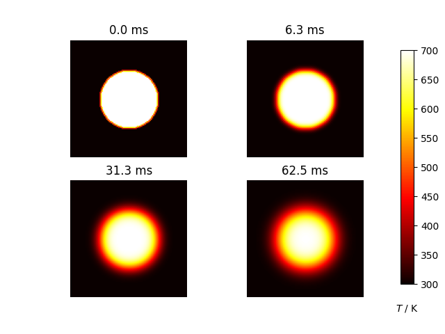

# diffusion2d

## Description

This package solves 2d diffusion heat equation using finite difference method. Available adjustable parameters are respectively dx, dy, and Diffusivity D. And output 4 stages of it in a matplotlib pyplot.


## Installing the package

1. Ensure python above 3.10.11, that I build with this version of python.
```bash
python --version
```
2. Install dependencies as specified in requiremnts
```bash
python -m pip install -r requirements.txt
```
3. Install the package
```bash
python -m pip install diffusion2d
```

## Running this package

Running it directly with default parameters
```bash
python diffusion2d/diffusion2d/diffusion2d.py
```
Or with specific parameters
```bash
python
import diffusion2d.diffusion2d as d2d
d2d.solve(dx=0.1, dy=0.1, D=4)
```

## Citing

The [origin](https://github.com/Simulation-Software-Engineering/diffusion2d) of this work is based on [Chapter 7 of the book "Learning Scientific Programming with Python"](https://scipython.com/book/chapter-7-matplotlib/examples/the-two-dimensional-diffusion-equation/)